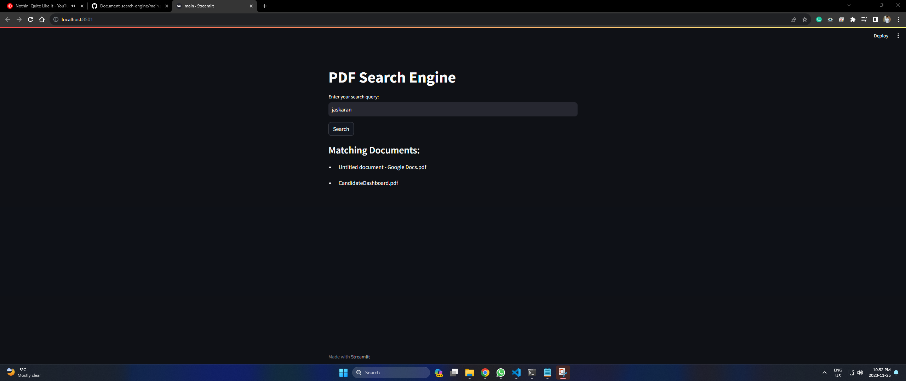

# Document-search-engine
Codebase for document search engine in python to search through PDF documents. More file types will be supported later

Entry point - main.py

## Application architecture:

Steps:

1. PDF Parsing:
Use a PDF parsing library to extract text from PDF files. PyPDF2 and pdfminer
Write a function to iterate through the PDF files in a directory, extract text, and store it along with the filename.

2. Create a DataFrame:
Use a library like Pandas to create a DataFrame with columns for filenames and text content.

3. Text Preprocessing:
Preprocess the text data by converting it to lowercase, removing stop words, punctuation, and any other noise.

4. Create a Reverse Index:
Build a reverse index from the preprocessed text. This involves creating a dictionary where each unique word is a key, and the corresponding values are the documents (or positions in documents) where that word appears.

5. User Input and Query Processing:
Accept user input for queries.
Preprocess the user's query similarly to the document text (lowercasing, removing stop words, etc.).

6. Search Engine Logic:
Search through the reverse index for the words in the user's query.
Return relevant documents based on the search results.

Future steps:

1. Autosuggestions
2. <s>GUI web interface</s> 
2. Add support for Word, PPT files.